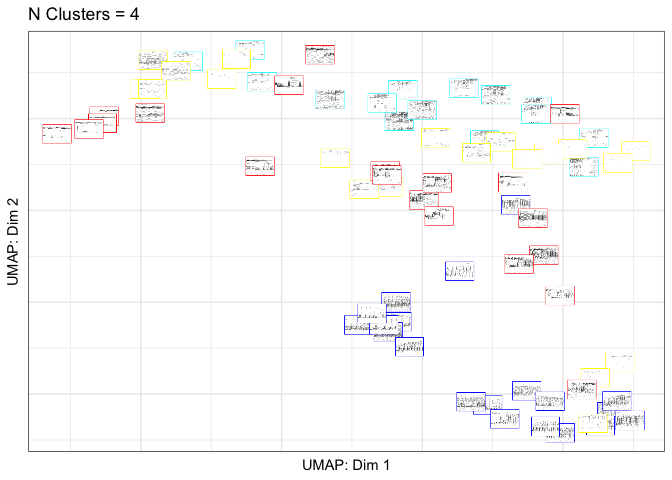
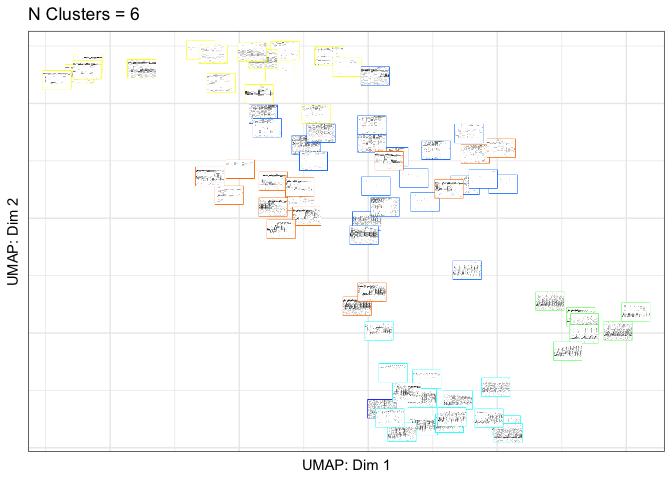

gibbonR: An R package for the automated detection and classification of
female gibbon calls from long-term acoustic recordings
================

-   [Authors](#authors)
-   [Package description](#package-description)
-   [Tutorial](#tutorial)
-   [Quick start guide](#quick-start-guide)
    -   [You can install the development version from GitHub
        with:](#you-can-install-the-development-version-from-github-with)
    -   [Part 1. Training Data with Labeled .wav
        clips](#part-1-training-data-with-labeled-wav-clips)
-   [Part 2. Run the
    detector/classifier](#part-2-run-the-detectorclassifier)
    -   [Part 2a. Feature extraction](#part-2a-feature-extraction)
    -   [Part 2b. Run DetectClassify](#part-2b-run-detectclassify)
-   [Part 3. Data visualization](#part-3-data-visualization)
    -   [Part 3a. Create a UMAP plot colored by
        class](#part-3a-create-a-umap-plot-colored-by-class)

<!-- README.md is generated from README.Rmd. Please edit that file -->

# Authors

Dena J. Clink & Holger Klinck  
K. Lisa Yang Center for Conservation Bioacoustics, Cornell Lab of
Ornithology, Cornell University

# Package description

The field of bioacoustics is inherently multidisciplinary and relies on
computer scientists, engineers, and ecologists. This package is directed
towards ecologists who are interested in incorporating bioacoustics into
their research, but may not have the skills or training. The goal for
the creation of this package was to make commonly used signal processing
techniques and various machine learning algorithms readily available in
R for anyone interested in using bioacoustics in their research.

*Planned release of updated package October 31, 2022*

# Tutorial

<https://denajgibbon.github.io/gibbonR-tutorial/>

# Quick start guide

## You can install the development version from [GitHub](https://github.com/DenaJGibbon) with:

``` r
# install.packages("devtools")
# devtools::install_github("DenaJGibbon/gibbonR")

library(gibbonR)
#> Loading required package: stringr
#> Loading required package: e1071
#> Loading required package: randomForest
#> randomForest 4.7-1
#> Type rfNews() to see new features/changes/bug fixes.
#> Loading required package: tuneR
#> Loading required package: seewave
```

## Part 1. Training Data with Labeled .wav clips

### Read in clips and calculate MFCCs

``` r
TrainingWavFilesDir <- 
  "/Users/denaclink/Desktop/RStudio Projects/gibbonR/data/MultipleSoundClasses/"

trainingdata <- gibbonR::MFCCFunction(input.dir=TrainingWavFilesDir, min.freq = 400, max.freq = 1600,win.avg="TRUE")


trainingdata$class <- as.factor(trainingdata$class)
```

### Compare Random Forest and Support Vector Machine for Supervised Classification

``` r
trainingdata$class <- as.factor(trainingdata$class)


ml.model.svm <- e1071::svm(trainingdata[, 2:ncol(trainingdata)], trainingdata$class, kernel = "radial", 
                           cross = 25,
                           probability = TRUE)

print(paste('SVM accuracy',ml.model.svm$tot.accuracy))
#> [1] "SVM accuracy 88"


ml.model.rf <- randomForest::randomForest(x=trainingdata[, 2:ncol(trainingdata)], y = trainingdata$class)


print(ml.model.rf)
#> 
#> Call:
#>  randomForest(x = trainingdata[, 2:ncol(trainingdata)], y = trainingdata$class) 
#>                Type of random forest: classification
#>                      Number of trees: 500
#> No. of variables tried at each split: 13
#> 
#>         OOB estimate of  error rate: 12%
#> Confusion matrix:
#>               female.gibbon leaf.monkey noise solo.gibbon class.error
#> female.gibbon            18           0     1           1   0.1000000
#> leaf.monkey               0          11     4           0   0.2666667
#> noise                     0           0    19           1   0.0500000
#> solo.gibbon               0           1     1          18   0.1000000
```

# Part 2. Run the detector/classifier

## Part 2a. Feature extraction

``` r
# Specify the folder where the training data will be saved
TrainingDataFolderLocation <- "/Users/denaclink/Desktop/RStudio Projects/gibbonR/data/TrainingDataFromRavenSelectionTables/"
  
TrainingDataMFCC <- MFCCFunction(input.dir= TrainingDataFolderLocation, min.freq = 400, max.freq = 1600,win.avg="TRUE")
  
  TrainingDataMFCC$class <- as.factor(TrainingDataMFCC$class)
```

## Part 2b. Run DetectClassify

``` r
  TestFileDirectory <- '/Users/denaclink/Library/CloudStorage/Box-Box/gibbonRSampleFiles/GibbonTestFiles'
  
  OutputDirectory <-  "/Users/denaclink/Desktop/RStudio Projects/gibbonR/data/DetectAndClassifyOutput"
  
  DetectAndClassify(input=TestFileDirectory,
                    input.type='directory',
                    feature.df=TrainingDataMFCC,
                    model.type.list=c('SVM','RF'),
                    tune = TRUE,
                    short.wav.duration=300,
                    target.signal = c("female.gibbon"),
                    min.freq = 400, max.freq = 1600,
                    noise.quantile.val=0.15,
                    time.window.number =3,
                    n.windows = 9, num.cep = 12,
                    spectrogram.window =160,
                    pattern.split = ".wav",
                    min.signal.dur = 3,
                    max.sound.event.dur = 25,
                    maximum.separation =1,
                    probability.thresh.svm = 0.15,
                    probability.thresh.rf = 0.15,
                    wav.output = "TRUE",
                    output.dir =OutputDirectory,
                    swift.time=TRUE,time.start=5,time.stop=10,
                    write.csv.output=FALSE,verbose=TRUE,
                    random.sample='NA')
#> [1] "Machine learning in progress..."
#> [1] "SVM in progress..."
#> [1] "SVM accuracy 98.1132075471698"
#> Time difference of 1.613401 secs
#> [1] "RF in progress..."
#> 
#> Call:
#>  randomForest(x = feature.df[, 2:ncol(feature.df)], y = feature.df$class) 
#>                Type of random forest: classification
#>                      Number of trees: 500
#> No. of variables tried at each split: 13
#> 
#>         OOB estimate of  error rate: 7.55%
#> Confusion matrix:
#>               female.gibbon noise class.error
#> female.gibbon            24     2  0.07692308
#> noise                     2    25  0.07407407
#> Time difference of 0.06283998 secs
#> [1] "Classifying for target signal female.gibbon"
#> [1] "Computing spectrogram for file S11_20180217_080003 1 out of 1"
#> [1] "Running detector over sound files"
#> [1] "Creating datasheet"
#> [1] "System processed 7201 seconds in 15 seconds this translates to 493.3 hours processed in 1 hour"
```

# Part 3. Data visualization

## Part 3a. Create a UMAP plot colored by class

``` r
library(gibbonR)
library(ggpubr)
#> Loading required package: ggplot2
#> 
#> Attaching package: 'ggplot2'
#> The following object is masked from 'package:randomForest':
#> 
#>     margin
UMAPBiplotAddSpectrograms(input.dir.Focal="/Users/denaclink/Desktop/RStudio Projects/gibbonR/data/MultipleSoundClasses/",output.dir.Focal="/Users/denaclink/Desktop/RStudio Projects/gibbonR/data/MultipleSoundClasses/Thumbnails/",add.spectrograms=TRUE,min.freq=400,max.freq=1600,main="UMAP Plot")
#> [1] "Step 1 Calculating MFCCs"
#> [1] "Step 2 Creating biplot"
#> [1] "Step 3 Creating Spectrograms"
#> [1] "/Users/denaclink/Desktop/RStudio Projects/gibbonR/data/MultipleSoundClasses/Thumbnails/ already exists"
#> [1] "Step 4 Adding Spectrograms to Plot "
```

 \##
Part 3b. Create a UMAP plot colored by affinity propagation clustering

``` r
library(gibbonR)
library(ggpubr)
library(apcluster)
#> 
#> Attaching package: 'apcluster'
#> The following object is masked from 'package:stats':
#> 
#>     heatmap
AffinityBiplotAddSpectrograms(input.dir.Focal="/Users/denaclink/Desktop/RStudio Projects/gibbonR/data/MultipleSoundClasses/",output.dir.Focal="/Users/denaclink/Desktop/RStudio Projects/gibbonR/data/MultipleSoundClasses/Thumbnails/",class='fixed', q.fixed=0.1,add.spectrograms=TRUE,min.freq=400,max.freq=1600,main="UMAP Plot")
#> [1] "Step 1 Calculating MFCCs"
#> [1] "Step 2 Computing unsupervised clustering with fixed q"
#> [1] "Step 3 Creating Spectrograms "
#> [1] "/Users/denaclink/Desktop/RStudio Projects/gibbonR/data/MultipleSoundClasses/Thumbnails/ already exists"
#> [1] "Adding Spectrograms to Plot Step 3 of 3"
```



### How to cite

This package is currently in development, with submission to rOpenSci
planned shortly. In the interim, please cite the arXiv preprint:

Clink, D. J. & H. Klinck. (2019). gibbonR: An R package for the
detection and classification of acoustic signals using machine learning.
arXiv, 1906.02572. <https://doi.org/10.48550/arXiv.1906.02572>
