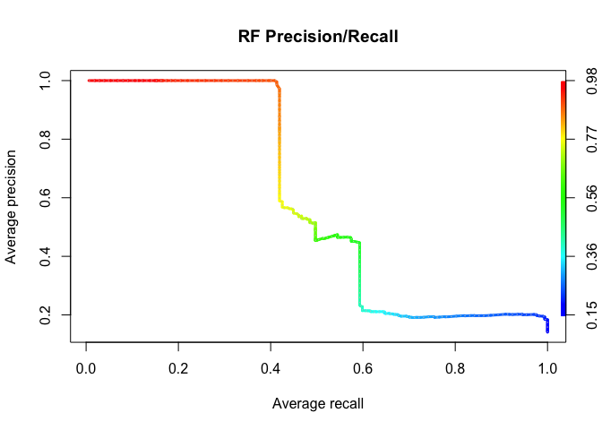
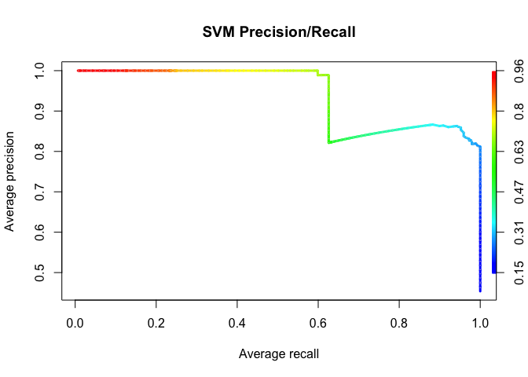
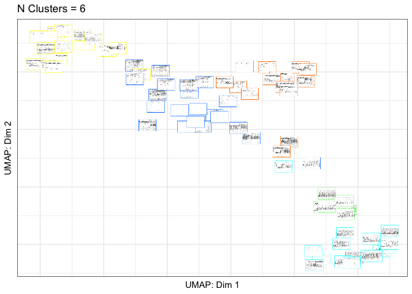

October 11 2022

<!-- README.md is generated from README.Rmd. Please edit that file -->

# gibbonR: An R package for the automated detection and classification of female gibbon calls from long-term acoustic recordings

Dena J. Clink & Holger Klinck  
K. Lisa Yang Center for Conservation Bioacoustics, Cornell Lab of
Ornithology, Cornell University

### Package description

The field of bioacoustics is inherently multidisciplinary and relies on
computer scientists, engineers, and ecologists. This package is directed
towards ecologists who are interested in incorporating bioacoustics into
their research, but may not have the skills or training. The goal for
the creation of this package was to make commonly used signal processing
techniques and various machine learning algorithms readily available in
R for anyone interested in using bioacoustics in their research.

# Getting started

## You can install the development version from [GitHub](https://github.com/DenaJGibbon) with:

``` r
# install.packages("devtools")
# devtools::install_github("DenaJGibbon/gibbonR")

library(gibbonR)
#> Loading required package: stringr
#> Loading required package: e1071
#> Loading required package: randomForest
#> randomForest 4.7-1
#> Type rfNews() to see new features/changes/bug fixes.
#> Loading required package: tuneR
#> Loading required package: seewave
```

# Part 1. Prepare Training Data

In ‘gibbonR’ there are two ways that you can format your training data.
The first can be a set of labelled .wav clips with the class indicated
in the name of the file (e.g., ‘gibbon_01.wav’ and ‘noise_01.wav’). The
second is to have a folder of selection tables created in Raven Pro (K.
Lisa Yang Center for Conservation Bioacoustics) and a folder with the
associated ‘.wav’ files. For the second approach there must be an
annotation column indicating the call type and it is assumed that all
signals of interest are annotated, and the rest of the files contain
only background noise.

## Part 1A. Training Data with Labeled .wav clips

### Read in clips and calculate MFCCs

``` r
TrainingWavFilesDir <- 
  "/Users/denaclink/Desktop/RStudio Projects/gibbonR/data/MultipleSoundClasses/"

trainingdata <- gibbonR::MFCCFunction(input.dir=TrainingWavFilesDir, min.freq = 400, max.freq = 1600,win.avg="TRUE")


trainingdata$class <- as.factor(trainingdata$class)
```

### Compare Random Forest and Support Vector Machine for Supervised Classification

``` r
trainingdata$class <- as.factor(trainingdata$class)


ml.model.svm <- e1071::svm(trainingdata[, 2:ncol(trainingdata)], trainingdata$class, kernel = "radial", 
                           cross = 25,
                           probability = TRUE)

print(paste('SVM accuracy',ml.model.svm$tot.accuracy))
#> [1] "SVM accuracy 88"


ml.model.rf <- randomForest::randomForest(x=trainingdata[, 2:ncol(trainingdata)], y = trainingdata$class)


print(ml.model.rf)
#> 
#> Call:
#>  randomForest(x = trainingdata[, 2:ncol(trainingdata)], y = trainingdata$class) 
#>                Type of random forest: classification
#>                      Number of trees: 500
#> No. of variables tried at each split: 13
#> 
#>         OOB estimate of  error rate: 12%
#> Confusion matrix:
#>               female.gibbon leaf.monkey noise solo.gibbon class.error
#> female.gibbon            17           0     2           1        0.15
#> leaf.monkey               0          12     3           0        0.20
#> noise                     0           0    18           2        0.10
#> solo.gibbon               0           0     1          19        0.05
```

## Part 1B. Training Data with Raven Selection Tables

### Prepare training data from labeled annotations

``` r
# Specify the folder where the training data will be saved
TrainingDataFolderLocation <- "/Users/denaclink/Desktop/RStudio Projects/gibbonR/data/TrainingDataFromRavenSelectionTables"

# Directory with annotated selection tables
AnnotatedSelectionTables <- list.files("/Users/denaclink/Desktop/RStudio Projects/gibbonR/data/SelectionTables/GibbonTrainingSelectionTables/",
                                       full.names = T)

# Directory with corresponding .wav files
AnnotatedWaveFiles <- list.files("/Users/denaclink/Library/CloudStorage/Box-Box/gibbonRSampleFiles/GibbonTrainingFiles/",full.names = T)
AnnotatedWaveFilesShort <- list.files("/Users/denaclink/Library/CloudStorage/Box-Box/gibbonRSampleFiles/GibbonTrainingFiles/",full.names = F)
AnnotatedWaveFilesShort <- str_split_fixed(AnnotatedWaveFilesShort,pattern = '.wav', n=2)[,1]

# Loop to cut out the corresponding annotations into short clips
for(i in 1: length(AnnotatedSelectionTables)){
  
  # Read in selection table
  TempSelectionTable <- read.delim2(AnnotatedSelectionTables[i])
  
  # Find the corresponding soundfile
  SoundFileIndex <- which(str_detect(AnnotatedSelectionTables[i],AnnotatedWaveFilesShort))
  
  TempAnnotateWave <- readWave(AnnotatedWaveFiles[SoundFileIndex])
  
  ShortSoundClips <- lapply(1:nrow(TempSelectionTable),
                                function(j) extractWave(TempAnnotateWave,
                                                        from= as.numeric(TempSelectionTable[j,]$Begin.Time..s.),
                                                        to=as.numeric(TempSelectionTable[j,]$ End.Time..s.),
                                                        xunit = c("time"),plot=F,output="Wave"))
  # Write wave files to folder
  for(k in 1:length(ShortSoundClips)){
    TempClip <- ShortSoundClips[[k]]
    WavFileName <- paste(TrainingDataFolderLocation,'/female.gibbon_', k, '.wav',sep="")
    writeWave(TempClip,WavFileName,extensible = F)
  }
  
  
}
```

### Prepare noise training data from files without target signal

``` r
# Specify the folder where the training data will be saved
TrainingDataFolderLocation <- "/Users/denaclink/Desktop/RStudio Projects/gibbonR/data/TrainingDataFromRavenSelectionTables/"

# Directory with annotated selection tables
NoiseSelectionTables <- list.files("/Users/denaclink/Desktop/RStudio Projects/gibbonR/data/SelectionTables/NoiseSelectionTables/",
                                       full.names = T)

# Directory with corresponding .wav files
NoiseWaveFiles <- list.files("/Users/denaclink/Library/CloudStorage/Box-Box/gibbonRSampleFiles/NoiseFiles/",full.names = T)
NoiseWaveFilesShort <- list.files("/Users/denaclink/Library/CloudStorage/Box-Box/gibbonRSampleFiles/NoiseFiles/",full.names = F)
NoiseWaveFilesShort <- str_split_fixed(NoiseWaveFilesShort,pattern = '.wav', n=2)[,1]

for(i in 1:length(NoiseSelectionTables)){
  
  # Find the corresponding soundfile
  SoundFileIndex <- which(str_detect(NoiseSelectionTables[i],NoiseWaveFilesShort))

  DetectBLED(input=NoiseWaveFiles[SoundFileIndex],
           min.freq = 400, 
           max.freq = 1600,
           noise.quantile.val=0.3,
           file.type='wav',
           spectrogram.window =512,
           pattern.split = ".wav", 
           min.signal.dur = 3,
           max.sound.event.dur = 12, 
           output = "wav",
           wav.output = "TRUE", 
           output.dir = TrainingDataFolderLocation,
           swift.time=TRUE,
           time.start=06,
           time.stop=11,
           write.csv.output=TRUE,
           verbose=TRUE,
           random.sample=FALSE)
}
```

### Now read in clips based on Raven Selection tables and calculate MFCCs

``` r
TrainingWavFilesDir <- 
  "/Users/denaclink/Desktop/RStudio Projects/gibbonR/data/TrainingDataFromRavenSelectionTables/"

trainingdata <- gibbonR::MFCCFunction(input.dir=TrainingWavFilesDir, min.freq = 400, max.freq = 1600,win.avg="TRUE")


trainingdata$class <- as.factor(trainingdata$class)
```

### Compare Random Forest and Support Vector Machine for Supervised Classification

``` r
trainingdata$class <- as.factor(trainingdata$class)


ml.model.svm <- e1071::svm(trainingdata[, 2:ncol(trainingdata)], trainingdata$class, kernel = "radial", 
                           cross = 25,
                           probability = TRUE)

print(paste('SVM accuracy',ml.model.svm$tot.accuracy))
#> [1] "SVM accuracy 98.1132075471698"


ml.model.rf <- randomForest::randomForest(x=trainingdata[, 2:ncol(trainingdata)], y = trainingdata$class)


print(ml.model.rf)
#> 
#> Call:
#>  randomForest(x = trainingdata[, 2:ncol(trainingdata)], y = trainingdata$class) 
#>                Type of random forest: classification
#>                      Number of trees: 500
#> No. of variables tried at each split: 13
#> 
#>         OOB estimate of  error rate: 7.55%
#> Confusion matrix:
#>               female.gibbon noise class.error
#> female.gibbon            24     2  0.07692308
#> noise                     2    25  0.07407407
```

# Part 2. Run the detector/classifier

## Part 2a. Feature extraction

``` r
# Specify the folder where the training data will be saved
TrainingDataFolderLocation <- "/Users/denaclink/Desktop/RStudio Projects/gibbonR/data/TrainingDataFromRavenSelectionTables/"
  
TrainingDataMFCC <- MFCCFunction(input.dir= TrainingDataFolderLocation, min.freq = 400, max.freq = 1600,win.avg="TRUE")
#> [1] "processing sound event 1 out of 53"
#> [1] "processing sound event 2 out of 53"
#> [1] "processing sound event 3 out of 53"
#> [1] "processing sound event 4 out of 53"
#> [1] "processing sound event 5 out of 53"
#> [1] "processing sound event 6 out of 53"
#> [1] "processing sound event 7 out of 53"
#> [1] "processing sound event 8 out of 53"
#> [1] "processing sound event 9 out of 53"
#> [1] "processing sound event 10 out of 53"
#> [1] "processing sound event 11 out of 53"
#> [1] "processing sound event 12 out of 53"
#> [1] "processing sound event 13 out of 53"
#> [1] "processing sound event 14 out of 53"
#> [1] "processing sound event 15 out of 53"
#> [1] "processing sound event 16 out of 53"
#> [1] "processing sound event 17 out of 53"
#> [1] "processing sound event 18 out of 53"
#> [1] "processing sound event 19 out of 53"
#> [1] "processing sound event 20 out of 53"
#> [1] "processing sound event 21 out of 53"
#> [1] "processing sound event 22 out of 53"
#> [1] "processing sound event 23 out of 53"
#> [1] "processing sound event 24 out of 53"
#> [1] "processing sound event 25 out of 53"
#> [1] "processing sound event 26 out of 53"
#> [1] "processing sound event 27 out of 53"
#> [1] "processing sound event 28 out of 53"
#> [1] "processing sound event 29 out of 53"
#> [1] "processing sound event 30 out of 53"
#> [1] "processing sound event 31 out of 53"
#> [1] "processing sound event 32 out of 53"
#> [1] "processing sound event 33 out of 53"
#> [1] "processing sound event 34 out of 53"
#> [1] "processing sound event 35 out of 53"
#> [1] "processing sound event 36 out of 53"
#> [1] "processing sound event 37 out of 53"
#> [1] "processing sound event 38 out of 53"
#> [1] "processing sound event 39 out of 53"
#> [1] "processing sound event 40 out of 53"
#> [1] "processing sound event 41 out of 53"
#> [1] "processing sound event 42 out of 53"
#> [1] "processing sound event 43 out of 53"
#> [1] "processing sound event 44 out of 53"
#> [1] "processing sound event 45 out of 53"
#> [1] "processing sound event 46 out of 53"
#> [1] "processing sound event 47 out of 53"
#> [1] "processing sound event 48 out of 53"
#> [1] "processing sound event 49 out of 53"
#> [1] "processing sound event 50 out of 53"
#> [1] "processing sound event 51 out of 53"
#> [1] "processing sound event 52 out of 53"
#> [1] "processing sound event 53 out of 53"
  
  TrainingDataMFCC$class <- as.factor(TrainingDataMFCC$class)
```

## Part 2b. Run DetectClassify

``` r
  TestFileDirectory <- '/Users/denaclink/Library/CloudStorage/Box-Box/gibbonRSampleFiles/GibbonTestFiles'
  
  OutputDirectory <-  "/Users/denaclink/Desktop/RStudio Projects/gibbonR/data/DetectAndClassifyOutput"
  
  DetectAndClassify(input=TestFileDirectory,
                    input.type='directory',
                    feature.df=TrainingDataMFCC,
                    model.type.list=c('SVM','RF'),
                    tune = TRUE,
                    short.wav.duration=300,
                    target.signal = c("female.gibbon"),
                    min.freq = 400, max.freq = 1600,
                    noise.quantile.val=0.15,
                    time.window.number =3,
                    n.windows = 9, num.cep = 12,
                    spectrogram.window =160,
                    pattern.split = ".wav",
                    min.signal.dur = 3,
                    max.sound.event.dur = 25,
                    maximum.separation =1,
                    probability.thresh.svm = 0.15,
                    probability.thresh.rf = 0.15,
                    wav.output = "TRUE",
                    output.dir =OutputDirectory,
                    swift.time=TRUE,time.start=5,time.stop=10,
                    write.csv.output=FALSE,verbose=TRUE,
                    random.sample='NA')
#> [1] "Machine learning in progress..."
#> [1] "SVM in progress..."
#> [1] "SVM accuracy 98.1132075471698"
#> Time difference of 1.684304 secs
#> [1] "RF in progress..."
#> 
#> Call:
#>  randomForest(x = feature.df[, 2:ncol(feature.df)], y = feature.df$class) 
#>                Type of random forest: classification
#>                      Number of trees: 500
#> No. of variables tried at each split: 13
#> 
#>         OOB estimate of  error rate: 5.66%
#> Confusion matrix:
#>               female.gibbon noise class.error
#> female.gibbon            25     1  0.03846154
#> noise                     2    25  0.07407407
#> Time difference of 0.06321907 secs
#> [1] "Classifying for target signal female.gibbon"
#> [1] "Computing spectrogram for file S11_20180217_080003 1 out of 1"
#> [1] "Running detector over sound files"
#> [1] "Creating datasheet"
#> [1] "System processed 7201 seconds in 15 seconds this translates to 490.5 hours processed in 1 hour"
```

# Part 3. Calculate performance metrics

## Part 3a. Prepare data for performance metrics

``` r
# Set location of test file selection tables
input.dir.text.files <- "/Users/denaclink/Desktop/RStudio Projects/gibbonR/data/SelectionTables/GibbonTestSelectionTables"

Annotatedfiles <- list.files(input.dir.text.files,full.names = T)

ListOfAnnotatedFilesShort <- list.files(input.dir.text.files,full.names = F)

nslash <- str_count(Annotatedfiles,pattern = '/')[1]+1
snames <- str_split_fixed(Annotatedfiles,pattern = '/',n=nslash)[,nslash]

all.detections <- data.frame()
for(x in 1:length(Annotatedfiles)){
  temp.table <- read.delim2(Annotatedfiles[x],fill = T,header =T)
  file.name <- str_split_fixed(snames[x],pattern = '[.]',n=2)[,1]
  recorder <- str_split_fixed(file.name,pattern='_',n=3)[,1]
  date <- str_split_fixed(file.name,pattern='_',n=3)[,2]
  time <- str_split_fixed(file.name,pattern='_',n=3)[,3]
  
  if(nrow(temp.table >0)){
    temp.table.updated <- cbind.data.frame(file.name,recorder,date,time,temp.table)
  } else {
    temp.row <- as.data.frame(t(rep('NA',ncol(temp.table))))
    colnames(temp.row) <- colnames(temp.table)
    temp.table.updated <- cbind.data.frame(file.name,recorder,date,time,temp.row)
    
  }
  all.detections <- rbind.data.frame(all.detections,temp.table.updated)
}
```

## Part 3b. Identify true and false positives

``` r
  OutputDirectory <-  "/Users/denaclink/Desktop/RStudio Projects/gibbonR/data/DetectAndClassifyOutput"
    
  all.combinedprecision.recall.randomiter <- data.frame()
  range.secs.start <- 6
  range.secs.end <- 6
  
  ### Detections using band-limited energy summation
  gibbondetects <- OutputDirectory
  list.ml <-  list.files(gibbondetects, full.names = T, pattern='.wav')

  
  # Need to focus on gibbons for this validation
  nslash <- str_count(list.ml[[1]],'/')+1
  list.ml.signals <- str_split_fixed(list.ml,pattern = '/',n=nslash)[,nslash]
  
  list.ml.signals <- str_split_fixed(list.ml.signals,pattern = '_',n=5)[,4]
  
  
  list.ml <- 
    list.ml[which(list.ml.signals=='female.gibbon')]
  
  
  ml.detection.df <- data.frame()
  
  for(y in 1:length(list.ml)){
    L.wav <- list.ml[[y]]
    n.slash  <- str_count(L.wav, pattern = "/")[1] + 1
    
    det.file.name <- str_split_fixed(L.wav,"/",n=n.slash)[,n.slash]
    det.file.name <- str_split_fixed(det.file.name,".wav",n=2)[,1]
    
    file.name <- paste(str_split_fixed(det.file.name,"_",n=5)[,1],str_split_fixed(det.file.name,"_",n=5)[,2],
                       str_split_fixed(det.file.name,"_",n=5)[,3], sep='_')
    det.date <- str_split_fixed(det.file.name,"_",n=5)[,2]
    det.time <- str_split_fixed(det.file.name,"_",n=5)[,3]
    det.swift <- str_split_fixed(det.file.name,"_",n=5)[,1]
    det.time.start <- as.numeric(str_split_fixed(det.file.name,"_",n=9)[,6])
    det.time.end <- as.numeric(str_split_fixed(det.file.name,"_",n=9)[,7])
    probability <- str_split_fixed(det.file.name,"_",n=8)[,8]
    ml.algorithm <- str_split_fixed(det.file.name,"_",n=7)[,5]
    
    detections.df <- cbind.data.frame(file.name,det.swift, det.date, det.time,det.time.start,det.time.end,probability,ml.algorithm)
    
    ml.detection.df <- rbind.data.frame(ml.detection.df,detections.df)
  }
  
  
  recall.snr.all.df <- data.frame()
  for(x in 1:nrow(ml.detection.df)){
    all.detections.subset <- ml.detection.df[x,]
    validate.detect.subset <-subset(all.detections,file.name==as.character(all.detections.subset$file.name))
    validate.detect.subset$Begin.Time..s. <- as.numeric(validate.detect.subset$Begin.Time..s.)
    min.start.time <- as.numeric(all.detections.subset$det.time.start)-range.secs.start
    max.start.time <- as.numeric(all.detections.subset$det.time.start)+range.secs.end
    
    detections.ml <- subset(validate.detect.subset, Begin.Time..s.>min.start.time & Begin.Time..s.< max.start.time)
    
      if(nrow(detections.ml)>0){
      all.detections.subset$class.label <- '1'
      } else{
        all.detections.subset$class.label <- '-1'
      }
   
    recall.snr.all.df <- rbind.data.frame(recall.snr.all.df,all.detections.subset)
  }
  
```

## Part 3c. Calculate and plot performance metrics using ‘ROCR’

``` r
library(ROCR)

auc.df <- data.frame()
performance.df <- data.frame()

  
  ml.index <- unique(recall.snr.all.df$ml.algorithm)
  for(m in 1:length(ml.index)){
  
    temp.subset <-
    subset(recall.snr.all.df,
           ml.algorithm==ml.index[m])
  
  predictions <- as.numeric(temp.subset$probability)
  labels <- (temp.subset$class.label)
  pred <- prediction(predictions, labels)
  perf <- performance(pred, "rec", "prec")
  perfauc <- performance(pred, "aucpr")
  Precision <- perf@x.values[[1]]
  Recall <- perf@y.values[[1]]
  Threshold <- perf@alpha.values[[1]]
  AUC <- perfauc@y.values[[1]]
  perfF1 <- performance(pred, "f")
  F1 <-  perfF1@y.values[[1]]
  print(AUC)
  ml.algorithm <- ml.index[m]
  tempauc <- cbind.data.frame(AUC,ml.algorithm)
  auc.df <- rbind.data.frame(auc.df,tempauc)
  
  temp.performance <- cbind.data.frame(Precision,Recall,Threshold,F1,ml.algorithm)
  performance.df <- rbind.data.frame(performance.df,temp.performance)
  
  perf <- performance(pred, "prec", "rec")

  plot(perf,
     avg= "threshold",
     colorize=TRUE,
     lwd= 3,
     main= paste(ml.index[m],'Precision/Recall'))
  
plot(perf,
     lty=3,
     col="grey78",
     add=TRUE)

  }  
#> [1] 0.6145943
```



    #> [1] 0.9392172



# Part 4. Unsupervised clustering

## Part 4a. Create a UMAP plot colored by class

``` r
library(gibbonR)
library(ggpubr)
#> Loading required package: ggplot2
#> 
#> Attaching package: 'ggplot2'
#> The following object is masked from 'package:randomForest':
#> 
#>     margin
UMAPBiplotAddSpectrograms(input.dir.Focal="/Users/denaclink/Desktop/RStudio Projects/gibbonR/data/MultipleSoundClasses/",output.dir.Focal="/Users/denaclink/Desktop/RStudio Projects/gibbonR/data/MultipleSoundClasses/Thumbnails/",add.spectrograms=TRUE,min.freq=400,max.freq=1600,main="UMAP Plot")
#> [1] "Step 1 Calculating MFCCs"
#> [1] "processing sound event 1 out of 75"
#> [1] "processing sound event 2 out of 75"
#> [1] "processing sound event 3 out of 75"
#> [1] "processing sound event 4 out of 75"
#> [1] "processing sound event 5 out of 75"
#> [1] "processing sound event 6 out of 75"
#> [1] "processing sound event 7 out of 75"
#> [1] "processing sound event 8 out of 75"
#> [1] "processing sound event 9 out of 75"
#> [1] "processing sound event 10 out of 75"
#> [1] "processing sound event 11 out of 75"
#> [1] "processing sound event 12 out of 75"
#> [1] "processing sound event 13 out of 75"
#> [1] "processing sound event 14 out of 75"
#> [1] "processing sound event 15 out of 75"
#> [1] "processing sound event 16 out of 75"
#> [1] "processing sound event 17 out of 75"
#> [1] "processing sound event 18 out of 75"
#> [1] "processing sound event 19 out of 75"
#> [1] "processing sound event 20 out of 75"
#> [1] "processing sound event 21 out of 75"
#> [1] "processing sound event 22 out of 75"
#> [1] "processing sound event 23 out of 75"
#> [1] "processing sound event 24 out of 75"
#> [1] "processing sound event 25 out of 75"
#> [1] "processing sound event 26 out of 75"
#> [1] "processing sound event 27 out of 75"
#> [1] "processing sound event 28 out of 75"
#> [1] "processing sound event 29 out of 75"
#> [1] "processing sound event 30 out of 75"
#> [1] "processing sound event 31 out of 75"
#> [1] "processing sound event 32 out of 75"
#> [1] "processing sound event 33 out of 75"
#> [1] "processing sound event 34 out of 75"
#> [1] "processing sound event 35 out of 75"
#> [1] "processing sound event 36 out of 75"
#> [1] "processing sound event 37 out of 75"
#> [1] "processing sound event 38 out of 75"
#> [1] "processing sound event 39 out of 75"
#> [1] "processing sound event 40 out of 75"
#> [1] "processing sound event 41 out of 75"
#> [1] "processing sound event 42 out of 75"
#> [1] "processing sound event 43 out of 75"
#> [1] "processing sound event 44 out of 75"
#> [1] "processing sound event 45 out of 75"
#> [1] "processing sound event 46 out of 75"
#> [1] "processing sound event 47 out of 75"
#> [1] "processing sound event 48 out of 75"
#> [1] "processing sound event 49 out of 75"
#> [1] "processing sound event 50 out of 75"
#> [1] "processing sound event 51 out of 75"
#> [1] "processing sound event 52 out of 75"
#> [1] "processing sound event 53 out of 75"
#> [1] "processing sound event 54 out of 75"
#> [1] "processing sound event 55 out of 75"
#> [1] "processing sound event 56 out of 75"
#> [1] "processing sound event 57 out of 75"
#> [1] "processing sound event 58 out of 75"
#> [1] "processing sound event 59 out of 75"
#> [1] "processing sound event 60 out of 75"
#> [1] "processing sound event 61 out of 75"
#> [1] "processing sound event 62 out of 75"
#> [1] "processing sound event 63 out of 75"
#> [1] "processing sound event 64 out of 75"
#> [1] "processing sound event 65 out of 75"
#> [1] "processing sound event 66 out of 75"
#> [1] "processing sound event 67 out of 75"
#> [1] "processing sound event 68 out of 75"
#> [1] "processing sound event 69 out of 75"
#> [1] "processing sound event 70 out of 75"
#> [1] "processing sound event 71 out of 75"
#> [1] "processing sound event 72 out of 75"
#> [1] "processing sound event 73 out of 75"
#> [1] "processing sound event 74 out of 75"
#> [1] "processing sound event 75 out of 75"
#> [1] "Step 2 Creating biplot"
#> [1] "Step 3 Creating Spectrograms"
#> [1] "/Users/denaclink/Desktop/RStudio Projects/gibbonR/data/MultipleSoundClasses/Thumbnails/ already exists"
#> [1] "Step 4 Adding Spectrograms to Plot "
```

 \##
Part 4b. Create a UMAP plot colored by affinity propagation clustering

``` r
library(gibbonR)
library(ggpubr)
library(apcluster)
#> 
#> Attaching package: 'apcluster'
#> The following object is masked from 'package:stats':
#> 
#>     heatmap
AffinityBiplotAddSpectrograms(input.dir.Focal="/Users/denaclink/Desktop/RStudio Projects/gibbonR/data/MultipleSoundClasses/",output.dir.Focal="/Users/denaclink/Desktop/RStudio Projects/gibbonR/data/MultipleSoundClasses/Thumbnails/",class='fixed', q.fixed=0.1,add.spectrograms=TRUE,min.freq=400,max.freq=1600,main="UMAP Plot")
#> [1] "Step 1 Calculating MFCCs"
#> [1] "processing sound event 1 out of 75"
#> [1] "processing sound event 2 out of 75"
#> [1] "processing sound event 3 out of 75"
#> [1] "processing sound event 4 out of 75"
#> [1] "processing sound event 5 out of 75"
#> [1] "processing sound event 6 out of 75"
#> [1] "processing sound event 7 out of 75"
#> [1] "processing sound event 8 out of 75"
#> [1] "processing sound event 9 out of 75"
#> [1] "processing sound event 10 out of 75"
#> [1] "processing sound event 11 out of 75"
#> [1] "processing sound event 12 out of 75"
#> [1] "processing sound event 13 out of 75"
#> [1] "processing sound event 14 out of 75"
#> [1] "processing sound event 15 out of 75"
#> [1] "processing sound event 16 out of 75"
#> [1] "processing sound event 17 out of 75"
#> [1] "processing sound event 18 out of 75"
#> [1] "processing sound event 19 out of 75"
#> [1] "processing sound event 20 out of 75"
#> [1] "processing sound event 21 out of 75"
#> [1] "processing sound event 22 out of 75"
#> [1] "processing sound event 23 out of 75"
#> [1] "processing sound event 24 out of 75"
#> [1] "processing sound event 25 out of 75"
#> [1] "processing sound event 26 out of 75"
#> [1] "processing sound event 27 out of 75"
#> [1] "processing sound event 28 out of 75"
#> [1] "processing sound event 29 out of 75"
#> [1] "processing sound event 30 out of 75"
#> [1] "processing sound event 31 out of 75"
#> [1] "processing sound event 32 out of 75"
#> [1] "processing sound event 33 out of 75"
#> [1] "processing sound event 34 out of 75"
#> [1] "processing sound event 35 out of 75"
#> [1] "processing sound event 36 out of 75"
#> [1] "processing sound event 37 out of 75"
#> [1] "processing sound event 38 out of 75"
#> [1] "processing sound event 39 out of 75"
#> [1] "processing sound event 40 out of 75"
#> [1] "processing sound event 41 out of 75"
#> [1] "processing sound event 42 out of 75"
#> [1] "processing sound event 43 out of 75"
#> [1] "processing sound event 44 out of 75"
#> [1] "processing sound event 45 out of 75"
#> [1] "processing sound event 46 out of 75"
#> [1] "processing sound event 47 out of 75"
#> [1] "processing sound event 48 out of 75"
#> [1] "processing sound event 49 out of 75"
#> [1] "processing sound event 50 out of 75"
#> [1] "processing sound event 51 out of 75"
#> [1] "processing sound event 52 out of 75"
#> [1] "processing sound event 53 out of 75"
#> [1] "processing sound event 54 out of 75"
#> [1] "processing sound event 55 out of 75"
#> [1] "processing sound event 56 out of 75"
#> [1] "processing sound event 57 out of 75"
#> [1] "processing sound event 58 out of 75"
#> [1] "processing sound event 59 out of 75"
#> [1] "processing sound event 60 out of 75"
#> [1] "processing sound event 61 out of 75"
#> [1] "processing sound event 62 out of 75"
#> [1] "processing sound event 63 out of 75"
#> [1] "processing sound event 64 out of 75"
#> [1] "processing sound event 65 out of 75"
#> [1] "processing sound event 66 out of 75"
#> [1] "processing sound event 67 out of 75"
#> [1] "processing sound event 68 out of 75"
#> [1] "processing sound event 69 out of 75"
#> [1] "processing sound event 70 out of 75"
#> [1] "processing sound event 71 out of 75"
#> [1] "processing sound event 72 out of 75"
#> [1] "processing sound event 73 out of 75"
#> [1] "processing sound event 74 out of 75"
#> [1] "processing sound event 75 out of 75"
#> [1] "Step 2 Computing unsupervised clustering with fixed q"
#> [1] "Step 3 Creating Spectrograms "
#> [1] "/Users/denaclink/Desktop/RStudio Projects/gibbonR/data/MultipleSoundClasses/Thumbnails/ already exists"
#> [1] "Adding Spectrograms to Plot Step 3 of 3"
```



### How to cite

This package is currently in development, with submission to rOpenSci
planned shortly. In the interim, please cite the arXiv preprint:

Clink, D. J. & H. Klinck. (2019). gibbonR: An R package for the
detection and classification of acoustic signals using machine learning.
arXiv, 1906.02572. <https://doi.org/10.48550/arXiv.1906.02572>
