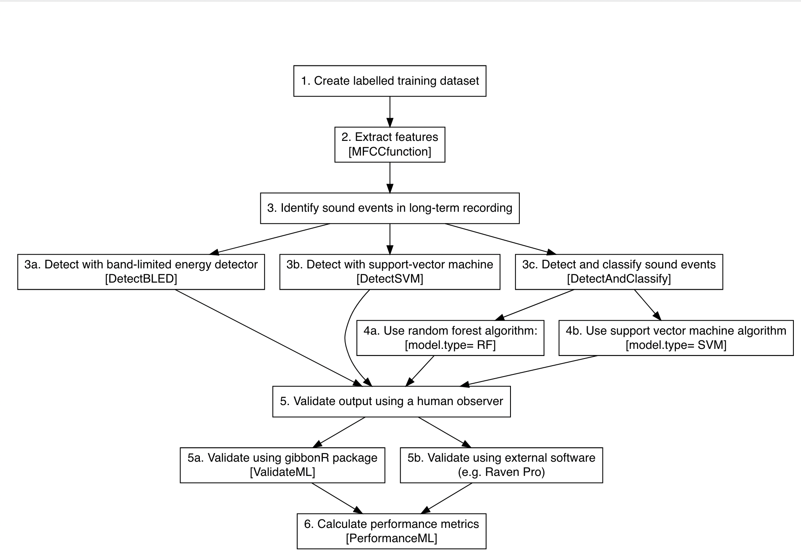

March 14 2022

<!-- README.md is generated from README.Rmd. Please edit that file -->

# gibbonR: An R package for classification, detection and visualization of acoustic signals using machine learning

Dena J. Clink & Holger Klinck  
K. Lisa Yang Center for Conservation Bioacoustics, Cornell Lab of
Ornithology, Cornell University

### Package description

The field of bioacoustics is inherently multidisciplinary and relies on
computer scientists, engineers, and ecologists. This package is directed
towards ecologists who are interested in incorporating bioacoustics into
their research, but may not have the skills or training. The goal for
the creation of this package was to make commonly used signal processing
techniques and various machine learning algorithms readily available in
R for anyone interested in using bioacoustics in their research.

### Summary of package use and functions

### Installation

Coming soon\!

### Tutorial

Coming soon\!

### How to cite

This package is currently in development, with submission to rOpenSci
planned shortly. In the interim, please cite the arXiv preprint:

Clink, D. J. & H. Klinck. (2019). gibbonR: An R package for the
detection and classification of acoustic signals using machine learning.
arXiv, 1906.02572. <https://doi.org/10.48550/arXiv.1906.02572>
